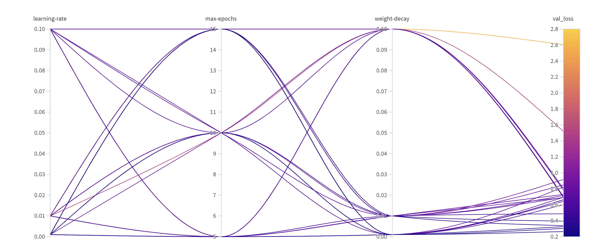

# Exam template for 02476 Machine Learning Operations

This is the report template for the exam. Please only remove the text formatted as with three dashes in front and behind
like:

```--- question 1 fill here ---```

Where you instead should add your answers. Any other changes may have unwanted consequences when your report is
auto-generated at the end of the course. For questions where you are asked to include images, start by adding the image
to the `figures` subfolder (please only use `.png`, `.jpg` or `.jpeg`) and then add the following code in your answer:

```markdown

```

In addition to this markdown file, we also provide the `report.py` script that provides two utility functions:

Running:

```bash
python report.py html
```

Will generate a `.html` page of your report. After the deadline for answering this template, we will auto-scrape
everything in this `reports` folder and then use this utility to generate a `.html` page that will be your serve
as your final hand-in.

Running

```bash
python report.py check
```

Will check your answers in this template against the constraints listed for each question e.g. is your answer too
short, too long, or have you included an image when asked. For both functions to work you mustn't rename anything.
The script has two dependencies that can be installed with

```bash
pip install typer markdown
```

## Overall project checklist

The checklist is *exhaustive* which means that it includes everything that you could do on the project included in the
curriculum in this course. Therefore, we do not expect at all that you have checked all boxes at the end of the project.
The parenthesis at the end indicates what module the bullet point is related to. Please be honest in your answers, we
will check the repositories and the code to verify your answers.

### Week 1

* [x] Create a git repository (M5)
* [x] Make sure that all team members have write access to the GitHub repository (M5)
* [x] Create a dedicated environment for you project to keep track of your packages (M2)
* [x] Create the initial file structure using cookiecutter with an appropriate template (M6)
* [x] Fill out the `data.py` file such that it downloads whatever data you need and preprocesses it (if necessary) (M6)
* [x] Add a model to `model.py` and a training procedure to `train.py` and get that running (M6)
* [x] Remember to fill out the `requirements.txt` and `requirements_dev.txt` file with whatever dependencies that you
    are using (M2+M6)
* [x] Remember to comply with good coding practices (`pep8`) while doing the project (M7)
* [x] Do a bit of code typing and remember to document essential parts of your code (M7)
* [x] Setup version control for your data or part of your data (M8)
* [ ] Add command line interfaces and project commands to your code where it makes sense (M9)
* [x] Construct one or multiple docker files for your code (M10)
* [x] Build the docker files locally and make sure they work as intended (M10)
* [x] Write one or multiple configurations files for your experiments (M11)
* [x] Used Hydra to load the configurations and manage your hyperparameters (M11)
* [ ] Use profiling to optimize your code (M12)
* [x] Use logging to log important events in your code (M14)
* [x] Use Weights & Biases to log training progress and other important metrics/artifacts in your code (M14)
* [x] Consider running a hyperparameter optimization sweep (M14)
* [x] Use PyTorch-lightning (if applicable) to reduce the amount of boilerplate in your code (M15)

### Week 2

* [x] Write unit tests related to the data part of your code (M16)
* [x] Write unit tests related to model construction and or model training (M16)
* [x] Calculate the code coverage (M16)
* [x] Get some continuous integration running on the GitHub repository (M17)
* [x] Add caching and multi-os/python/pytorch testing to your continuous integration (M17)
* [ ] Add a linting step to your continuous integration (M17)
* [ ] Add pre-commit hooks to your version control setup (M18)
* [ ] Add a continues workflow that triggers when data changes (M19)
* [ ] Add a continues workflow that triggers when changes to the model registry is made (M19)
* [x] Create a data storage in GCP Bucket for your data and link this with your data version control setup (M21)
* [x] Create a trigger workflow for automatically building your docker images (M21)
* [x] Get your model training in GCP using either the Engine or Vertex AI (M21)
* [x] Create a FastAPI application that can do inference using your model (M22)
* [x] Deploy your model in GCP using either Functions or Run as the backend (M23)
* [x] Write API tests for your application and setup continues integration for these (M24)
* [x] Load test your application (M24)
* [x] Create a more specialized ML-deployment API using either ONNX or BentoML, or both (M25)
* [x] Create a frontend for your API (M26)

### Week 3

* [ ] Check how robust your model is towards data drifting (M27)
* [ ] Deploy to the cloud a drift detection API (M27)
* [ ] Instrument your API with a couple of system metrics (M28)
* [ ] Setup cloud monitoring of your instrumented application (M28)
* [ ] Create one or more alert systems in GCP to alert you if your app is not behaving correctly (M28)
* [x] If applicable, optimize the performance of your data loading using distributed data loading (M29)
* [ ] If applicable, optimize the performance of your training pipeline by using distributed training (M30)
* [ ] Play around with quantization, compilation and pruning for you trained models to increase inference speed (M31)

### Extra

* [ ] Write some documentation for your application (M32)
* [ ] Publish the documentation to GitHub Pages (M32)
* [ ] Revisit your initial project description. Did the project turn out as you wanted?
* [ ] Create an architectural diagram over your MLOps pipeline
* [ ] Make sure all group members have an understanding about all parts of the project
* [ ] Uploaded all your code to GitHub

## Group information

### Question 1
> **Enter the group number you signed up on <learn.inside.dtu.dk>**
>
> Answer:

5

### Question 2
> **Enter the study number for each member in the group**
>
> Example:
>
> *sXXXXXX, sXXXXXX, sXXXXXX*
>
> Answer:

s214592, s214634, s214605, s214641

### Question 3
> **A requirement to the project is that you include a third-party package not covered in the course. What framework**
> **did you choose to work with and did it help you complete the project?**
>
> Recommended answer length: 100-200 words.
>
> Example:
> *We used the third-party framework ... in our project. We used functionality ... and functionality ... from the*
> *package to do ... and ... in our project*.
>
> Answer:

We used the third-party framework pytorch-image-models from huggingface. We used the functionality to load pre-trained image models from the package to load a pre-trained model into our project. This pre-trained model could then be used to finetune on our own dataset. This allowed us to circumvent training a model on a large dataset which would both be time consuming and resource intensive. We also used the third-party framework kagglehub to programatically download data from Kaggle using their package. This allows us to download data directly from Kaggle and can therefore also be used instead of data version control if this is desired.

## Coding environment

> In the following section we are interested in learning more about you local development environment. This includes
> how you managed dependencies, the structure of your code and how you managed code quality.

### Question 4

> **Explain how you managed dependencies in your project? Explain the process a new team member would have to go**
> **through to get an exact copy of your environment.**
>
> Recommended answer length: 100-200 words
>
> Example:
> *We used ... for managing our dependencies. The list of dependencies was auto-generated using ... . To get a*
> *complete copy of our development environment, one would have to run the following commands*
>
> Answer:

We used requirements.txt files for managing our dependencies. The list was auto-generated using pipreqs. The requirements are divided into requirements.txt, requirements_dev.txt, requirements_frontend.txt and requirements_test.txt. The regular requirements file is required to run the scripts in the environment. The dev requirements are necessary for developing, including formatting tools like ruff, which are not strictly required for running the scripts. The frontend requirements are used for the Streamlit application. The final requirements for testing is necessary for running the unit tests. To get a complete copy of our development environment, one would have to run the following commands:
pip install -r requirements.txt -r requirements_dev.txt
pip install -e .
The final command is necessary for installing the development environment as a package.

### Question 5

> **We expect that you initialized your project using the cookiecutter template. Explain the overall structure of your**
> **code. What did you fill out? Did you deviate from the template in some way?**
>
> Recommended answer length: 100-200 words
>
> Example:
> *From the cookiecutter template we have filled out the ... , ... and ... folder. We have removed the ... folder*
> *because we did not use any ... in our project. We have added an ... folder that contains ... for running our*
> *experiments.*
>
> Answer:

We followed the structure of the cookiecutter template very closely, and have used the src, models, tests and dockerfiles folders especially. We kept all the created folders as they were used, even if it was to a small extent. However, we removed evaluate.py, as we did model evaluation as part of the training in train.py. We have added a configs folder as well as a logs folder, for keeping track of user-defined logs and hydra config files respectively. Each local version of the development environment contains several cache folders which are ignored in the gitignore. These include ruff caches and mypy caches, which are created upon running ruff and mypy lint and formatting checkers.

### Question 6

> **Did you implement any rules for code quality and format? What about typing and documentation? Additionally,**
> **explain with your own words why these concepts matters in larger projects.**
>
> Recommended answer length: 100-200 words.
>
> Example:
> *We used ... for linting and ... for formatting. We also used ... for typing and ... for documentation. These*
> *concepts are important in larger projects because ... . For example, typing ...*
>
> Answer:

We did not implement our own rules for code formatting, but used the rules from the cookiecutter template pyproject.toml and checked those with ruff. We did decide on functions generally requiring at least a small sentence of documentation. We used ruff and mypy to actually check the linting and formatting and let it auto fix these issues when possible. Documentation, typing and formatting is very important in larger projects because it keeps code readable for everyone, even people who did not work on a specific part of the project. This also allows others to work on code they did not previously work on, and keeps a project streamlined, avoiding unnecessary issues with data types and confusion of functionality.

## Version control

> In the following section we are interested in how version control was used in your project during development to
> corporate and increase the quality of your code.

### Question 7

> **How many tests did you implement and what are they testing in your code?**
>
> Recommended answer length: 50-100 words.
>
> Example:
> *In total we have implemented X tests. Primarily we are testing ... and ... as these the most critical parts of our*
> *application but also ... .*
>
> Answer:

We implemented 5 different test cases across 3 different files. They test the data, to check if it is the correct dataset that is loaded, we check that the model is able to recieve data of the correct shape and give the expected output shape. The lasts tests ensure that the API is working, and is able to give a valid prediction and invalid prediction, based on input format. 

### Question 8

> **What is the total code coverage (in percentage) of your code? If your code had a code coverage of 100% (or close**
> **to), would you still trust it to be error free? Explain you reasoning.**
>
> Recommended answer length: 100-200 words.
>
> Example:
> *The total code coverage of code is X%, which includes all our source code. We are far from 100% coverage of our **
> *code and even if we were then...*
>
> Answer:

Our code coverage is 78%, which is most of our source code. Most of what is not covered is functionality relating to the model defining logging and training. Also, the data script for data pre-processing is mostly tested for loading working, and not that pre-processing is correct. However coverage is not necessarily a clear way to determine wether all bugs will be prevented. The tests should cover much of the code, but rather having good tests that are able to find bugs is more important. Because of this, 78% code coverage is acceptable, as the untested code is simple functionality which relies on earlier functions working, which are parts of the tests. This means that leaving these parts untested are not detrimental to the overall functionality of the project.

### Question 9

> **Did you workflow include using branches and pull requests? If yes, explain how. If not, explain how branches and**
> **pull request can help improve version control.**
>
> Recommended answer length: 100-200 words.
>
> Example:
> *We made use of both branches and PRs in our project. In our group, each member had an branch that they worked on in*
> *addition to the main branch. To merge code we ...*
>
> Answer:

We used both branches as well as pull requests. The branches were named after which specific feature was introduced in that branch, and were not exclusive to a specific group member, but rather exclusive to the specific feature. This allowed parallel workflow and avoided merge conflicts, which personal branches would likely introduce. When merging code at least one peer had to review and aprove, as well as tests being run and passed to ensure the code still passed the requirements we set. Branches and pull requests are important to ensure that the functionality of the main branch, which is actually running the program or live service, remains stable and working as intended.

### Question 10

> **Did you use DVC for managing data in your project? If yes, then how did it improve your project to have version**
> **control of your data. If no, explain a case where it would be beneficial to have version control of your data.**
>
> Recommended answer length: 100-200 words.
>
> Example:
> *We did make use of DVC in the following way: ... . In the end it helped us in ... for controlling ... part of our*
> *pipeline*
>
> Answer:

We used DVC through the cloud, to have control of the data and easy usage of the data for all participants. This ensured all of the group members had access to the same data. We did not update or add to the dataset throughout the project, however using DVC would have made this easier and shown when the data was changed or added to. Version controlling your data is beneficial in the same way that it is beneficial to version control your code. It allows us to know what versions of data was used at what times, and what experiments. This also makes it possible to revert to older versions of data in case something went wrong.

### Question 11

> **Discuss you continuous integration setup. What kind of continuous integration are you running (unittesting,**
> **linting, etc.)? Do you test multiple operating systems, Python  version etc. Do you make use of caching? Feel free**
> **to insert a link to one of your GitHub actions workflow.**
>
> Recommended answer length: 200-300 words.
>
> Example:
> *We have organized our continuous integration into 3 separate files: one for doing ..., one for running ... testing*
> *and one for running ... . In particular for our ..., we used ... .An example of a triggered workflow can be seen*
> *here: <weblink>*
>
> Answer:

We used a workflow which runs the tests using pytest and test code coverage when doing pull requests and pushes to the master branch. This tests our code using three operating systems: Windows, Ubuntu and MacOS. It also tests on 2 different versions of python. We use pip cache for faster testing. We also have a dependabot which is triggered monthly to ensure all dependencies are updated and work together. The continuous testing is divided into a tests.yaml file, and the dependabot is in a dependabot.yaml file. One of the tests involves dataloading, which required the data to be download on GitHub for the loading to be actually tested. This slows down the tests, but avoids the issue of being unable to push large datasets to a GitHub repository, while retaining the ability to test the functionality.
An example of a triggered workflow can be found here: https://github.com/Simo067m/02476_mlops_S25/actions/runs/12922261069. This workflow includes the unit tests from the project and is a successful run where all tests passed. On top of these, some cloud triggers also run on GitHub, but these are not defined in the .github folder. They are therefore not directly part of the GitHub workflows, but are still necessary to pass for a branch to be able to merge to master.

## Running code and tracking experiments

> In the following section we are interested in learning more about the experimental setup for running your code and
> especially the reproducibility of your experiments.

### Question 12

> **How did you configure experiments? Did you make use of config files? Explain with coding examples of how you would**
> **run a experiment.**
>
> Recommended answer length: 50-100 words.
>
> Example:
> *We used a simple argparser, that worked in the following way: Python  my_script.py --lr 1e-3 --batch_size 25*
>
> Answer:

When running experiments we used Wandb Sweeps and Wandb configurations to run with different hyperparameters. The sweep is initialized in a config file. The file can be run either using argparser or the invoke setup. Using invoke is simply done as: invoke train. If hyperparameters are not being tuned, config files are used, loaded by hydra. Then, the train script is simply run when the config file exists: python src/mlops_grp5/train.py.

### Question 13

> **Reproducibility of experiments are important. Related to the last question, how did you secure that no information**
> **is lost when running experiments and that your experiments are reproducible?**
>
> Recommended answer length: 100-200 words.
>
> Example:
> *We made use of config files. Whenever an experiment is run the following happens: ... . To reproduce an experiment*
> *one would have to do ...*
>
> Answer:

When starting training, a run is created in Wandb, which logs the hyperparameters and any information and metrics about how the training goes. The hyperparameters are loaded through config files, which makes it possible to re-run the experiment by loading the same config file. The trained model is saved locally and in the Wand model registry, allowing it to be loaded in for future inference. The larger hyperparameter sweeps were run using a sweep.yaml config file, which can be used again to rerun and reproduce the same results. To reproduce an experiment one would need the config file with the hyperparameters and the name of the model. The name of the model and other information during training is logged in a log file under the logs/ directory.

### Question 14

> **Upload 1 to 3 screenshots that show the experiments that you have done in W&B (or another experiment tracking**
> **service of your choice). This may include loss graphs, logged images, hyperparameter sweeps etc. You can take**
> **inspiration from [this figure](figures/wandb.png). Explain what metrics you are tracking and why they are**
> **important.**
>
> Recommended answer length: 200-300 words + 1 to 3 screenshots.
>
> Example:
> *As seen in the first image when have tracked ... and ... which both inform us about ... in our experiments.*
> *As seen in the second image we are also tracking ... and ...*
>
> Answer:

We used Wandb to log metrics from experiments, utilizing the features for sharing and experiment tracking.

As seen in the first image, we track the loss during training both for training steps and for validation steps. This is a numerical metric that is logged by the pytorch-lightning model. It shows the progress of the model loss during each training epoch, and the same for the validation steps. The graph is layered with multiple runs and experiments, which are labeled in the legend below the graph title.

As seen in the second image, during the testing step, there is only a single epoch naturally, so we do not have a graph the same way as the training loss graphs. Instead, it is simply a measure of how high the accuracy was on the test set after the model finished training. Since the graph is visualized as a bar even if the metric is simply one number, it makes it easy to compare visually what experiments performed better than others.

As seen in the third image, hyperparameter sweeps are visualized with the hyperparameters that were tested during the search.
The loss metrics are important since they show how well the training is going, as we want to minimize the loss, meaning this graph should have an overall decline over the progress of the training. The accuracy is important in a different way, since it shows how often the model predicts correctly, so we want this metric to be as high as possible.

### Question 15

> **Docker is an important tool for creating containerized applications. Explain how you used docker in your**
> **experiments/project? Include how you would run your docker images and include a link to one of your docker files.**
>
> Recommended answer length: 100-200 words.
>
> Example:
> *For our project we developed several images: one for training, inference and deployment. For example to run the*
> *training docker image: `docker run trainer:latest lr=1e-3 batch_size=64`. Link to docker file: <weblink>*
>
> Answer:

We have several images in our project: one for training, two for api deployment, and one for frontend deployment. For example, in order to run the training docker image, in which it is assumed that the hyperparameter config file is already contained, you would run: docker run --name *experiment_name* train:latest. Since the config file is contained in the image, there is no need to add any command line arguments. Having a dockerfile allows containerization and deployment, and an image can be automatically built from a dockerfile using automated workflows when code updates happen. This could be automatically training a new model and deploying it when changes are made to the model script.

### Question 16

> **When running into bugs while trying to run your experiments, how did you perform debugging? Additionally, did you**
> **try to profile your code or do you think it is already perfect?**
>
> Recommended answer length: 100-200 words.
>
> Example:
> *Debugging method was dependent on group member. Some just used ... and others used ... . We did a single profiling*
> *run of our main code at some point that showed ...*
>
> Answer:

Debugging was done using the native visual studio code debugger. Sometimes debugging was also done by print statements in the code and running it like normal. In generally our code is relatively simple and does not include many different scripts, therefore we opted to not perform profiling as there are not many changes to be made to the training loop, as this is handled by pytorch-lightning and is not defined by us. This does not mean that the code is perfect, but we do not believe that profiling will provide much in terms of optimization compared to a larger project that is involved with more parts than this one. 

## Working in the cloud

> In the following section we would like to know more about your experience when developing in the cloud.

### Question 17

> **List all the GCP services that you made use of in your project and shortly explain what each service does?**
>
> Recommended answer length: 50-200 words.
>
> Example:
> *We used the following two services: Engine and Bucket. Engine is used for... and Bucket is used for...*
>
> Answer:

Several GCP services are used throughout this project (implemented by following M20 and M21). Some are listed below:
- Cloud Storage served as the main storage for datasets and processed data, such as data.pt and labels.pt.
- IAM managed permissions and access control, ensuring the necessary services had the right roles to interact securely.
- Artifact Registry was utilized to store Docker images required for training.
- Cloud Build was employed to build these Docker images from source code.
- Cloud Logging helped debug and monitor training jobs by providing access to logs.
- Vertex AI was used for running custom training jobs and managing machine learning workflows.
- Wandb was integrated for experiment tracking, enabling logging of metrics like training loss and hyperparameters.

### Question 18

> **The backbone of GCP is the Compute engine. Explained how you made use of this service and what type of VMs**
> **you used?**
>
> Recommended answer length: 100-200 words.
>
> Example:
> *We used the compute engine to run our ... . We used instances with the following hardware: ... and we started the*
> *using a custom container: ...*
>
> Answer:

In this project, we used Google Compute Engine to power VMs for running training jobs.The training jobs used the n1-highmem-2 machine type, which provides 2 vCPUs and 13 GB of memory. This machine type is well-suited for workloads that require a higher memory-to-CPU ratio, such as training machine learning models on moderately sized datasets. The VMs were also provisioned as part of the Vertex AI custom training workflow, where the config.yaml defined the resource specifications. With replicaCount set to 1, a single VM was used to execute the training script. This setup ensured that the training workflows were efficient and appropriately resourced for the project’s needs.

### Question 19

> **Insert 1-2 images of your GCP bucket, such that we can see what data you have stored in it.**
> **You can take inspiration from [this figure](figures/bucket.png).**
>
> Answer:

The Cloud Storage holds 4 buckets, 1 for our dataset, 2 for functions and 1 for cloudbuild:


The bucket for our dataset looks like this:


### Question 20

> **Upload 1-2 images of your GCP artifact registry, such that we can see the different docker images that you have**
> **stored. You can take inspiration from [this figure](figures/registry.png).**
>
> Answer:


The artifact registry 'group5-repo' holding all Docker images for training and API are seen here: 


### Question 21

> **Upload 1-2 images of your GCP cloud build history, so we can see the history of the images that have been build in**
> **your project. You can take inspiration from [this figure](figures/build.png).**
>
> Answer:

The cloudbuilds are mostly done using triggers. However, earlier in the project they are created manually.


### Question 22

> **Did you manage to train your model in the cloud using either the Engine or Vertex AI? If yes, explain how you did**
> **it. If not, describe why.**
>
> Recommended answer length: 100-200 words.
>
> Example:
> *We managed to train our model in the cloud using the Engine. We did this by ... . The reason we choose the Engine*
> *was because ...*
>
> Answer:

We successfully trained my model in the cloud using Vertex AI. The training was configured through a config.yaml file,which defined the compute resources, container image, and training parameters. The training script was packaged into a Docker image and stored in the Artifact Registry, and the dataset was accessed directly from Cloud Storage, which was mounted in the training environment. The job was triggered using the ‘gcloud ai custom-jobs create’ command, referencing the config.yaml. This setup included parameters like the maximum number of epochs and environment variables, such as the WANDB_API_KEY for logging metrics to Weights & Biases. Vertex AI handled provisioning the VMs, running the container, and monitoring the job, ensuring a streamlined and efficient workflow. Overall, the training process was efficient and well-suited for cloud-based machine learning workflows.

## Deployment

### Question 23

> **Did you manage to write an API for your model? If yes, explain how you did it and if you did anything special. If**
> **not, explain how you would do it.**
>
> Recommended answer length: 100-200 words.
>
> Example:
> *We did manage to write an API for our model. We used FastAPI to do this. We did this by ... . We also added ...*
> *to the API to make it more ...*
>
> Answer:

We succesfully wrote APIs for our model using FastAPI. Initially, we created a regular FastAPI for inference with our model. This involved loading the model at application startup using FastAPI's lifespan feature, preprocessing uploaded images, and performing inference to classify images as "Fresh" or "Rotten". Additionally, we included error handling to manage invalid file uploads gracefully, enhancing the robustness of our API.
To make the API faster and more efficient, we converted our model to the ONNX format and created the ONNX API. ONNX is built for quicker predictions and works across different platforms, making it ideal for deployment. Using ONNX Runtime for predictions allowed us to take advantage of hardware acceleration, which reduced the time it takes to process requests. We also updated the ONNX API to provide not just the predicted class but also confidence scores, giving users more detailed and understandable results.

### Question 24

> **Did you manage to deploy your API, either in locally or cloud? If not, describe why. If yes, describe how and**
> **preferably how you invoke your deployed service?**
>
> Recommended answer length: 100-200 words.
>
> Example:
> *For deployment we wrapped our model into application using ... . We first tried locally serving the model, which*
> *worked. Afterwards we deployed it in the cloud, using ... . To invoke the service an user would call*
> *`curl -X POST -F "file=@file.json"<weburl>`*
>
> Answer:

We successfully deployed our API both locally and in the cloud. For deployment, we containerized our application using Docker, creating a dedicated Dockerfile for both the regular and ONNX APIs. Locally, we tested the containerized API by running it with Docker and invoking it via curl commands to ensure the endpoints functioned as expected.
For cloud deployment, we used Google Cloud Run, which allows for easy deployment of containerized applications. We created a cloudbuild.yaml file for each API to automate the process, including building the Docker image, pushing it to Google Artifact Registry, and deploying it to Cloud Run. 
To invoke the deployed service, users can send a POST request to the /predict endpoint with an image file using the following command:
"curl -X POST -F "file=@<path_to_image>" <cloud_run_url>/predict/"

For example, to classify an image with the ONNX-API we used:
"curl -X POST -F "file=@tests/data/fresh_sample.jpg" https://mlops-onnx-api-298235842440.europe-west1.run.app/predict/"


### Question 25

> **Did you perform any unit testing and load testing of your API? If yes, explain how you did it and what results for**
> **the load testing did you get. If not, explain how you would do it.**
>
> Recommended answer length: 100-200 words.
>
> Example:
> *For unit testing we used ... and for load testing we used ... . The results of the load testing showed that ...*
> *before the service crashed.*
>
> Answer:

We performed both unit testing and load testing for both of our APIs. For unit testing, we used Pytest to test individual components of the applications, such as image preprocessing and the inference logic. These tests helped us confirm that the components of both APIs worked in isolation and returned the expected results.

The load testing of both the standard API and the ONNX-optimized API was performed using Locust. The tests simulated 10 concurrent users with a spawn rate of 1 user per second over a 1-minute duration. The tests were performed on different systems and python versions.
On the standard API, using Windows and Python 3.12, the /predict endpoint had a median response time of 270 ms, with 95% of requests completing under 440 ms. The maximum response time was 750 ms.
The ONNX API performed better overall. As an example on Windows with python 3.12 the /predict endpoint had a median response time of 200 ms, with 95% completing under 360 ms. The maximum response time was 410 ms, significantly lower than the standard API.
These tests confirmed that the ONNX API is faster and more scalable, with both APIs demonstrating stability under load without failures.

### Question 26

> **Did you manage to implement monitoring of your deployed model? If yes, explain how it works. If not, explain how**
> **monitoring would help the longevity of your application.**
>
> Recommended answer length: 100-200 words.
>
> Example:
> *We did not manage to implement monitoring. We would like to have monitoring implemented such that over time we could*
> *measure ... and ... that would inform us about this ... behaviour of our application.*
>
> Answer:

We didn’t manage to set up monitoring for our deployed model, but it’s something that would have greatly improved the reliability and longevity of the application. For example, we could track key metrics like how many requests the model is receiving, how long it takes to make predictions, and how often errors occur. Using tools like Prometheus, we could expose these metrics on a /metrics endpoint and create dashboards to visualize trends over time. This would also allow us to set up alerts for issues like slow response times or increased errors, so we could quickly fix problems before they impact users.

## Overall discussion of project

> In the following section we would like you to think about the general structure of your project.

### Question 27

> **How many credits did you end up using during the project and what service was most expensive? In general what do**
> **you think about working in the cloud?**
>
> Recommended answer length: 100-200 words.
>
> Example:
> *Group member 1 used ..., Group member 2 used ..., in total ... credits was spend during development. The service*
> *costing the most was ... due to ... . Working in the cloud was ...*
>
> Answer:

In total we used credits worth 1.14$. The most expensive thing was artifact registry, taking up around 50% of credits. The next most expensive was the compute engine. This was due to the nature of the google cloud platform, where running code in a virtual machine is much more costly than storing data in the cloud. In general, working in the cloud is very powerful, but can also be very convoluted, as there are many, many different services which all require their own setup. Security and costs are different concerns which you do not consider as often when working locally.

### Question 28

> **Did you implement anything extra in your project that is not covered by other questions? Maybe you implemented**
> **a frontend for your API, use extra version control features, a drift detection service, a kubernetes cluster etc.**
> **If yes, explain what you did and why.**
>
> Recommended answer length: 0-200 words.
>
> Example:
> *We implemented a frontend for our API. We did this because we wanted to show the user ... . The frontend was*
> *implemented using ...*
>
> Answer:

We implemented a user-friendly frontend for our API to make it easier for users to interact with the model. Since the model classifies images of fruits and vegetables as either "Fresh" or "Rotten," we designed the frontend to allow users to easily upload images and view the predictions in a simple interface.

The frontend was built using Streamlit, which is a tool that can be used to create interactive interfaces. Users can upload a fruit or vegetable image, which is sent to the backend API for processing. The results, including predictions and confidence scores, are shown directly on the screen, making it easy to understand.

To make the frontend available online, we used Docker to package it and deployed it on Google Cloud Run. This setup ensures it can handle multiple users at once and works smoothly with the backend API. The frontend makes the API more user-friendly, especially for non-technical users, and provides a complete way to showcase what our model can do.

### Question 29

> **Include a figure that describes the overall architecture of your system and what services that you make use of.**
> **You can take inspiration from [this figure](figures/overview.png). Additionally, in your own words, explain the**
> **overall steps in figure.**
>
> Recommended answer length: 200-400 words
>
> Example:
>
> *The starting point of the diagram is our local setup, where we integrated ... and ... and ... into our code.*
> *Whenever we commit code and push to GitHub, it auto triggers ... and ... . From there the diagram shows ...*
>
> Answer:


The figure shows the overall structure of the pipeline. A developer pushes code to the GitHub repository, which triggers GitHub actions to perform tests. This also triggers an action in the cloud to create a new docker image based on the updated code. When the dev runs an experiment from a config file loaded by Hydra, the progess is logged to Wandb. At the end of the training, the model is saved to the Wandb model registry. On the Google cloud platform, a docker image is created for the API which then can be accessed by the end user. This makes the API use the latest model. When the user accesses the API, the latest API docker image is pulled for inference, and the user can upload their image to the API frontend to get a response. The user can then visually see what the result of the model inference was. The data also exists on the Google Cloud Platform, which can then be intertwined with the docker images created for training, as data can simply be pulled from the Google Cloud Buckets, making it unnecessary to have a local copy of the data. When the user interacts with the API, this can also be monitored on the Google Cloud Platform, making the connection double sided.

### Question 30

> **Discuss the overall struggles of the project. Where did you spend most time and what did you do to overcome these**
> **challenges?**
>
> Recommended answer length: 200-400 words.
>
> Example:
> *The biggest challenges in the project was using ... tool to do ... . The reason for this was ...*
>
> Answer:

Many of the challenges in the project was not necessarily using a tool by itself in the project, but rather the integration of multiple new tools together at the same time. For example, when setting up config files by hydra, we experienced issues in other scripts, as Hydra wants to be initialized once, and only once, but we wanted to have multiple config files for data and models seperately. This meant having to redo how some functionality worked in order to accomodate being sure that Hydra always only initializes once. As mentioned previously, working in the cloud can be quite complicated, especially when you are not very used to it. The abundance of functions makes it very easy to get disoriented, and the level of security is very different to working only locally, which is what we are most used to. Docker also caused some issues, as it can be quite abstract to understand how it works, and the images tend to be quite large even when you make sure to keep them as small as possible. Working with creating a package and having a pyproject.toml file also gave a few issues with relative imports and when importing a script from a directory that is far away from the current directory. An example of this is importing functions from src/ in the tests/ directory. However, this could largely be fixed by making sure the package was installed locally and by using absolute imports via the package.

### Question 31

> **State the individual contributions of each team member. This is required information from DTU, because we need to**
> **make sure all members contributed actively to the project. Additionally, state if/how you have used generative AI**
> **tools in your project.**
>
> Recommended answer length: 50-300 words.
>
> Example:
> *Student sXXXXXX was in charge of developing of setting up the initial cookie cutter project and developing of the*
> *docker containers for training our applications.*
> *Student sXXXXXX was in charge of training our models in the cloud and deploying them afterwards.*
> *All members contributed to code by...*
> *We have used ChatGPT to help debug our code. Additionally, we used GitHub Copilot to help write some of our code.*
> Answer:

Student s214592 was in charge of setting up the initial template and the model training. They also setup the train dockerfile, local logging and a few unit tests.
Student s214634 was in charge of Wandb logging and model registry, hyperparameter sweeping and training updates.
Student s214605 was in charge of cloud deployment and the GCP project including vm-integration and data storage.
Student s214641 was in charge of API development and deployment of it, as well as load testing and unit testing of the API and development and deployment of the Steamlit frontend. 
We have used ChatGPT to help debug our code and to generate some low-level logic code.